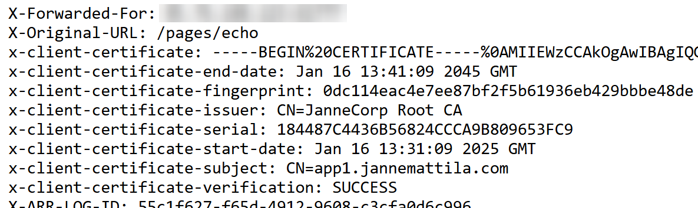

# Azure Application Gateway with mTLS

## Scenario

[Overview of mutual authentication with Application Gateway](https://learn.microsoft.com/en-us/azure/application-gateway/mutual-authentication-overview?tabs=powershell)

## Setup

### Variables

```powershell
# Alternatively, you can use also public IP address FQDN of the AppGw:
$domain = "contoso0000000035.swedencentral.cloudapp.azure.com"

# Certificate password
$certificatePasswordPlainText = "<your certificate password>"
$certificatePassword = ConvertTo-SecureString -String $certificatePasswordPlainText -Force -AsPlainText
```

### Create certificate setup

Here is example if you want to create certificate chain (based on [this](https://learn.microsoft.com/en-us/aspnet/core/security/authentication/certauth)):

```powershell
# Create Root CA
$rootCA = New-SelfSignedCertificate `
  -Subject "JanneCorp Root CA" `
  -FriendlyName "JanneCorp Root CA" `
  -CertStoreLocation "cert:\CurrentUser\My" `
  -NotAfter (Get-Date).AddYears(20) `
  -HashAlgorithm sha256 -KeyLength 4096 `
  -KeyExportPolicy Exportable `
  -KeyUsageProperty All `
  -KeyUsage CertSign, CRLSign, DigitalSignature `
  -TextExtension @("2.5.29.19={text}CA=1")

# To find existing Root CA
# $rootCA = Get-ChildItem -Path cert:\CurrentUser\my | Where-Object { $_.Subject -eq "CN=JanneCorp Root CA" }
$rootPassword = ConvertTo-SecureString -String "1234" -Force -AsPlainText

Get-ChildItem -Path cert:\CurrentUser\my\$($rootCA.Thumbprint) | 
  Export-PfxCertificate -FilePath JanneCorpRootCA.pfx -Password $rootPassword

# To find existing AppGw Certificate
# $appGwCertificate = Get-ChildItem -Path cert:\CurrentUser\my | Where-Object { $_.Subject -eq "CN=$domain" }

# Create AppGw Certificate
$appGwCertificate = New-SelfSignedCertificate `
  -CertStoreLocation cert:\CurrentUser\my `
  -DnsName $domain `
  -Signer $rootCA `
  -NotAfter (Get-Date).AddYears(20)

$appGwPassword = ConvertTo-SecureString -String "3456" -Force -AsPlainText

Get-ChildItem -Path cert:\CurrentUser\my\$($appGwCertificate.Thumbprint) | 
  Export-PfxCertificate -FilePath AppGw.pfx -Password $appGwPassword -ChainOption BuildChain

# Create client Certificate using the same Intermediate Certificate
$clientCertificate = New-SelfSignedCertificate `
  -CertStoreLocation cert:\CurrentUser\my `
  -DnsName "app1.jannemattila.com" `
  -HashAlgorithm sha256 -KeyLength 2048 -KeyExportPolicy Exportable `
  -Signer $rootCA `
  -NotAfter (Get-Date).AddYears(20)

$clientCertificatePassword = ConvertTo-SecureString -String "4567" -Force -AsPlainText

Get-ChildItem -Path cert:\CurrentUser\my\$($clientCertificate.Thumbprint) | 
  Export-PfxCertificate -FilePath client.pfx -Password $clientCertificatePassword -ChainOption BuildChain
```

### Convert pfx to CER and PEM

[Converting pfx to pem using openssl](https://stackoverflow.com/questions/15413646/converting-pfx-to-pem-using-openssl)

```bash
rootPassword="1234"
clientCertificatePassword="4567"

openssl pkcs12 -in JanneCorpRootCA.pfx -clcerts -nokeys -out JanneCorpRootCA.cer -nodes -passin pass:$rootPassword
openssl pkcs12 -in JanneCorpRootCA.pfx -out rootca_key.pem -nocerts -nodes -passin pass:$rootPassword
openssl pkcs12 -in JanneCorpRootCA.pfx -clcerts -nokeys -out rootca_cert.pem -nodes -passin pass:$rootPassword

# Convert the client certificate to PEM
openssl pkcs12 -in client.pfx -out client_key.pem -nocerts -nodes -passin pass:$clientCertificatePassword
openssl pkcs12 -in client.pfx -clcerts -nokeys -out client_cert.pem -nodes -passin pass:$clientCertificatePassword
```

### Deploy

```powershell
$result = .\deploy.ps1 -CertificatePassword $appGwPassword -AppFqdn "myip.jannemattila.com"
$result
$result.outputs.appGwFQDN
```

### Test

Application Gateway is configured to use
[Mutual authentication server variables](https://learn.microsoft.com/en-us/azure/application-gateway/rewrite-http-headers-url#mutual-authentication-server-variables)
and send following headers to the backend:



```bash
x-client-certificate: -----BEGIN%20CERTIFICATE-----%0A...%0A-----END%20CERTIFICATE-----%0A
x-client-certificate-end-date: Jan 16 13:41:09 2045 GMT
x-client-certificate-fingerprint: 0dc114eac4e7ee87bf2f5b61936eb429bbbe48de
x-client-certificate-issuer: CN=JanneCorp Root CA
x-client-certificate-serial: 184487C4436B56824CCCA9B809653FC9
x-client-certificate-start-date: Jan 16 13:31:09 2025 GMT
x-client-certificate-subject: CN=app1.jannemattila.com
x-client-certificate-verification: SUCCESS
```

**Use these in WSL/Linux**:

```powershell
curl "http://$domain" --verbose

curl "https://$domain" --verbose
curl "https://$domain" --verbose --insecure
curl "https://$domain" --verbose --cacert JanneCorpRootCA.cer

curl "https://$domain" --verbose --insecure --cert client.pfx:"4567" --cert-type P12
curl "https://$domain" --verbose --insecure --cert JanneCorpRootCA.pfx:"1234" --cert-type P12

curl "https://$domain" --verbose --insecure --cert client_cert.pem --key client_key.pem
curl "https://$domain" --verbose --insecure --cert rootca_cert.pem --key rootca_key.pem

curl "https://$domain" --verbose --cacert JanneCorpRootCA.cer --cert client_cert.pem --key client_key.pem
```

### Clean up

```powershell
Remove-AzResourceGroup -Name "rg-appgw-mtls" -Force
```
