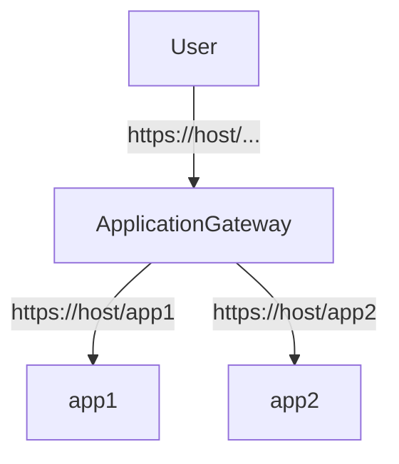
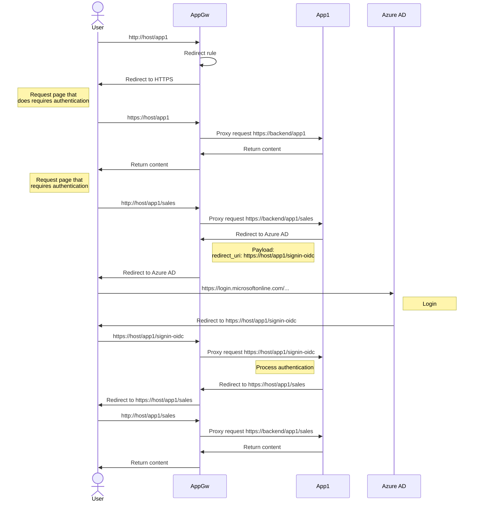

# Azure Application Gateway with two backend app services using Azure AD authentication

## Scenario

You want to use Azure Application Gateway in front of
Azure App Service applications. Those applications needs to be
available in paths e.g., `/app1` and `/app2`.

Please read [preserve the original HTTP host name between a reverse proxy and its back-end web application](https://docs.microsoft.com/en-us/azure/architecture/best-practices/host-name-preservation)
as general guidance on this topic from Azure Architecture Center.

In this demo scenario both applications require authentication
using Azure AD for certain parts of the applications. This means
that we don't want to have any conflicts in cookies etc. between
these applications. They should run on their own in their isolation
and authentication processes should be handled as same way as these applications
would be directly published to the end users.

## In-Scope of demo

- Demonstrate App Gateway
  - HTTP to HTTPS redirection
  - Path based routing to backends
  - Adding additional HTTP Header to backend request
- Show application level configuration options and changes
  to support this scenario

## Out-of-Scope of demo

- App Service applications are not inside VNet
  - You should use [private Endpoints](https://docs.microsoft.com/en-us/azure/app-service/networking/private-endpoint) for bringing these applications part of VNet infrastructure

## Architecture



## Flow



## Application configuration

Backend application must be aware that is running behind proxy.
Here is list of used configuration options from `app1` point of view
(full code available [here](https://github.com/JanneMattila/214-webapp-and-auth))

```charp
public void Configure(IApplicationBuilder app, IWebHostEnvironment env)
{
  // ...
  // Path to provide app from AppGw
  app.UsePathBase(new PathString("/app1"));
  
  // Enable AppGw to override the hostname
  var options = new ForwardedHeadersOptions
  {
    ForwardedHeaders =
      ForwardedHeaders.XForwardedHost |
      ForwardedHeaders.XForwardedFor |
      ForwardedHeaders.XForwardedProto
  };

  // Enable the forwarded headers to work
  // even if send from remote
  // NOTE: You must limit the allowedhosts to
  // allow this to work only to known addresses.
  options.KnownNetworks.Clear();
  options.KnownProxies.Clear();

  // Add *only* allowed hostname to be the one that AppGw is using
  options.AllowedHosts.Add("contoso00000000001.northeurope.cloudapp.azure.com");

  // Use above configurations
  app.UseForwardedHeaders(options);
  // ...
}
```

[Configure ASP.NET Core to work with proxy servers and load balancers](https://docs.microsoft.com/en-us/aspnet/core/host-and-deploy/proxy-load-balancer)

## Setup

### Variables

```powershell
# Public fully qualified domain name of our AppGw
$domain = "contoso00000000001.northeurope.cloudapp.azure.com"
# Certificate password
$certificatePasswordPlainText = "<your certificate password>"

# Azure AD app used in authentication
$clientId = "<your client id>"
$clientSecretPlainText = "<your client secret>"
```

### Create certificate to enable SSL

Based on instructions from [here](https://docs.microsoft.com/en-us/azure/application-gateway/create-ssl-portal):

```powershell
$cert = New-SelfSignedCertificate -certstorelocation cert:\localmachine\my -dnsname $domain

$certificatePassword = ConvertTo-SecureString -String $certificatePasswordPlainText -Force -AsPlainText
Export-PfxCertificate -Cert $cert -FilePath cert.pfx -Password $certificatePassword
```

### Deploy

```powershell
$clientSecret = ConvertTo-SecureString -String $clientSecretPlainText -Force -AsPlainText

# If you use default tenant
.\deploy.ps1 -CertificatePassword $certificatePassword -ClientId $clientId -ClientSecret $clientSecret -Authority $authority

# If you need to override the default tenant
$authority = "https://login.microsoftonline.com/<tenant-id>"
.\deploy.ps1 -CertificatePassword $certificatePassword -ClientId $clientId -ClientSecret $clientSecret -Authority $authority
```

### Test

```powershell
curl "http://$domain" --verbose
curl "http://$domain/app1/" --verbose

curl "https://$domain" --verbose --insecure

curl "https://$domain/app1" --verbose --insecure
curl "https://$domain/app1/sales" --verbose --insecure

curl "https://$domain/app2" --verbose --insecure
curl "https://$domain/app2/sales" --verbose --insecure
```

### Clean up

```powershell
Remove-AzResourceGroup -Name "rg-appgw-auth-demo" -Force
```
