# Azure Application Gateway and custom rules


### Deploy

```powershell
$result = .\deploy.ps1

$appGwfqdn = $result.outputs.appGwfqdn.value
$tester = $result.outputs.tester.value
```

### Examples automation scenarios

You can use [rule-updater.ps1](./rule-updater.ps1) to create custom rule for blocking high usage:

```powershell
# Block all IPs that have made over 1000 requests in last 60 minutes
.\rule-updater.ps1 -RequestLimit 1000 -Minutes 60
```

You can use [rule-geo.ps1](./rule-geo.ps1) to update your Geo Matching rule action:

```powershell
# Update Geo Matching rule to use Action 'Log'
.\rule-geo.ps1 -Action Log

# Update Geo Matching rule to use Action 'Block'
.\rule-geo.ps1 -Action Block
```

You can use [rule-cdn.ps1](./rule-cdn.ps1) to add Azure CDN IPs as allowed IPs:

```powershell
# Add Standard Verizon CDN IPs as allowed IP addresses
.\rule-cdn.ps1 -CDN Standard_Verizon
```

See [Retrieve the current POP IP list for Azure CDN](https://learn.microsoft.com/en-us/azure/cdn/cdn-pop-list-api) for more details.

### Test

Example deploys `RuleGeoDeny` rule which blocks users outside Finland.

Here is two sequence diagrams to better illustrate the test scenario:

1. Request from allowed geo:

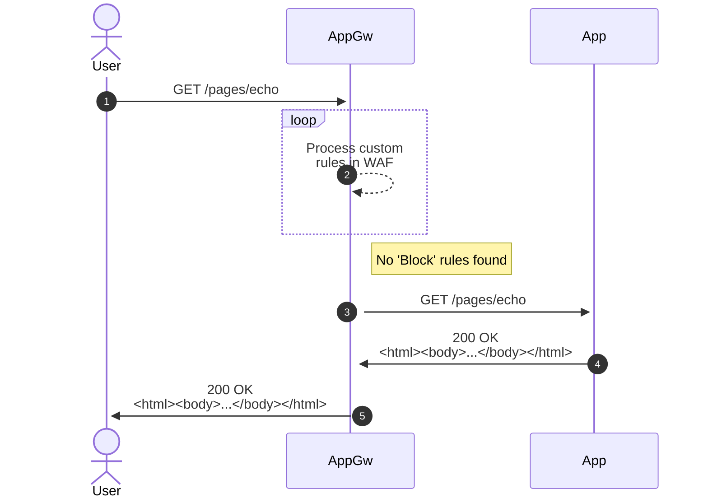

2. Request done via `Network test app` which is not running in allowed geo:

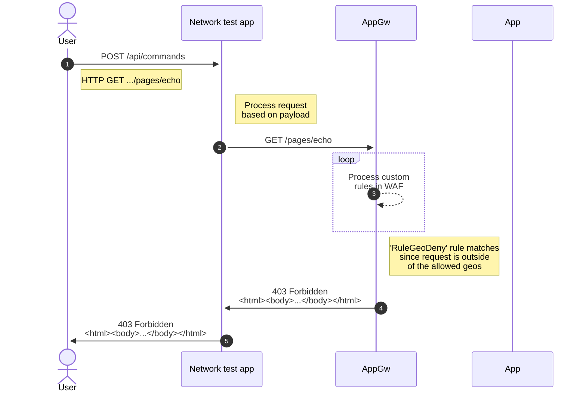

3. Request coming via CDN:

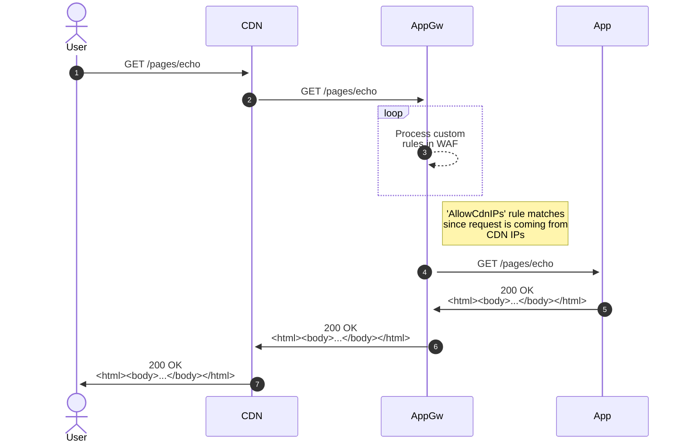

Example requests from command-line:

```powershell
start http://$appGwfqdn/pages/echo

curl http://$appGwfqdn/pages/echo --verbose

curl http://$appGwfqdn/pages/echo?text=/etc/passwd --verbose
curl http://$appGwfqdn/pages/echo??1=1=1 --verbose
```

Test header filtering:

```powershell
curl -H "x-custom-header: aablock-me"  http://$appGwfqdn/pages/echo
curl -H "x-custom-header: aablock-meaa"  http://$appGwfqdn/pages/echo
curl -H "x-custom-header: good"  http://$appGwfqdn/pages/echo
```

Use tester app to connect to our App Gateway to test Geo filtering:

```powershell
curl --data "HTTP GET http://$appGwfqdn/pages/echo"  https://$tester/api/commands
```

If you're blocked, you should get this error message if you haven't created custom error pages:

```html
<html>
<head><title>403 Forbidden</title></head>
<body>
<center><h1>403 Forbidden</h1></center>
<hr><center>Microsoft-Azure-Application-Gateway/v2</center>
</body>
</html>
```

This example contains following custom error pages [403](./html/403.html) and [502](./html/502.html).

### Analyze logs


Get usage in last 60 minutes grouped by Client IP:

`AzureDiagnostics` table:

```sql
AzureDiagnostics
| where Category == 'ApplicationGatewayAccessLog' and 
        OperationName == 'ApplicationGatewayAccess' and
        TimeGenerated >= ago(60min)
| summarize count() by clientIP_s
| project IP=clientIP_s, Requests=count_
| where Requests > 50
| order by Requests
```

Resource specific table:

```sql
AGWAccessLogs 
| where OperationName == 'ApplicationGatewayAccess' and
        TimeGenerated >= ago(60min)
| summarize count() by ClientIp
| project IP=ClientIp, Requests=count_
| where Requests > 50
| order by Requests
```

| IP      | Requests |
| ------- | -------- |
| 1.2.3.4 | 100      |
| 2.3.4.5 | 88       |

Get all firewall logs with rule `RuleGeoDeny`:

`AzureDiagnostics` table:

```sql
AzureDiagnostics
| where Category == 'ApplicationGatewayFirewallLog' and
        ruleId_s == 'RuleGeoDeny'
```

Resource specific table:

```sql
AGWFirewallLogs
| where OperationName == "ApplicationGatewayFirewall" and 
        RuleId == "RuleGeoDeny"
```

### Test by geo

```powershell
.\perf-test.ps1 -navigateUri http://$appGwfqdn -InstanceCount 10 -GeographyGroup Europe -ReportUri https://<yourapp>.azurewebsites.net/api/serverstatistics -ReportInterval 5
```

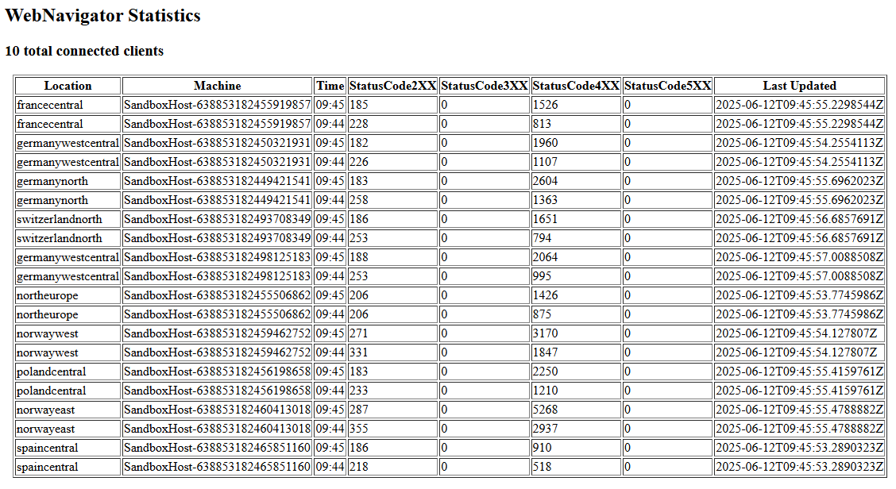

Plot chart about usage per country or by country and HTTP Status:

```sql
AGWAccessLogs 
| project TimeGenerated, ClientIp
| extend location = geo_info_from_ip_address(ClientIp)
| extend Country = tostring(location.country)
| project TimeGenerated, Country
| summarize count() by Country, bin(TimeGenerated, 1m)
| render timechart

AGWAccessLogs 
| project TimeGenerated, ClientIp, HttpStatus
| extend location = geo_info_from_ip_address(ClientIp)
| extend Country = tostring(location.country)
| project TimeGenerated, Country, HttpStatus
| extend CountryStatus = strcat(Country, "-", HttpStatus)
| summarize count() by CountryStatus, bin(TimeGenerated, 1m)
| render timechart
```

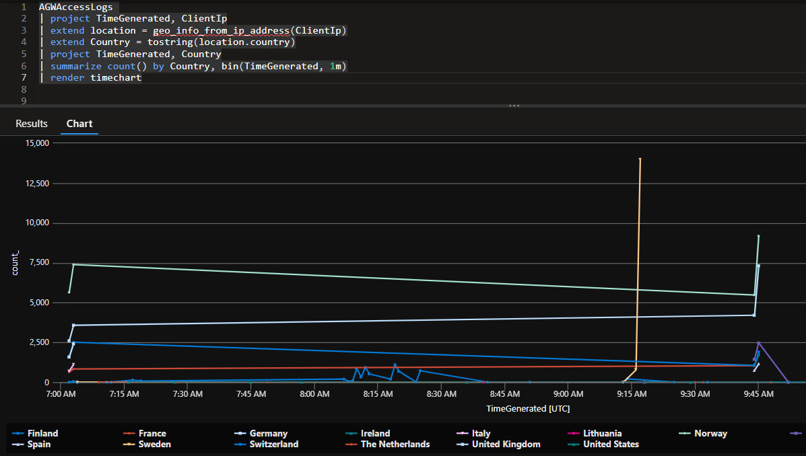

Firewall logs that have blocked traffic by IP or by Country:

```sql
AGWFirewallLogs
| where Action == "Blocked"
| project TimeGenerated, ClientIp
| summarize count() by ClientIp, bin(TimeGenerated, 1m)
| render timechart

AGWFirewallLogs
| where Action == "Blocked"
| project TimeGenerated, ClientIp
| extend location = geo_info_from_ip_address(ClientIp)
| extend Country = tostring(location.country)
| summarize count() by Country, bin(TimeGenerated, 1m)
| render timechart
```

See larger example end of this page.

Here are other example queries:

```sql
AGWAccessLogs
| where HttpStatus == 200
| project TimeGenerated, ClientIp
| summarize count() by ClientIp, bin(TimeGenerated, 1m)
| render timechart
```

```sql
AGWFirewallLogs
| where Action != "Log"
| project TimeGenerated, ClientIp
| summarize count() by ClientIp, bin(TimeGenerated, 1m)
| render timechart
```

### Example custom rules

#### Test `RuleBlockIPs`

```bicep
// ...
customRules: [
  {
    priority: 30
    name: 'RuleBlockIPs'
    action: 'Block'
    ruleType: 'MatchRule'
    matchConditions: [
      {
        operator: 'IPMatch'
        matchVariables: [
          {
            variableName: 'RemoteAddr'
          }
        ]
        matchValues: [
          '1.2.3.4'
          '2.3.4.5'
        ]
      }
    ]
  }
]
// ...
```

#### Test `RuleBlockCustomHeader`

```bicep
// ...
customRules: [
  {
    priority: 100
    name: 'RuleBlockCustomHeader'
    action: 'Block'
    ruleType: 'MatchRule'
    matchConditions: [
      {
        operator: 'Contains'
        negationConditon: false
        transforms: [
          'Lowercase'
        ]
        matchVariables: [
          {
            variableName: 'RequestHeaders'
            selector: 'x-custom-header'
          }
        ]
        matchValues: [
          'block-me'
        ]
      }
    ]
  }
]
// ...
```

### Clean up

```powershell
Remove-AzResourceGroup -Name "rg-appgw-custom-rules-demo" -Force
```

### Example 1

Here are larger examples:

- Sweden Central -> `NordicRateLimit` -> 2000 per minute per client
- Other countries -> `OtherCountriesRateLimit` -> 1000 per minute per client

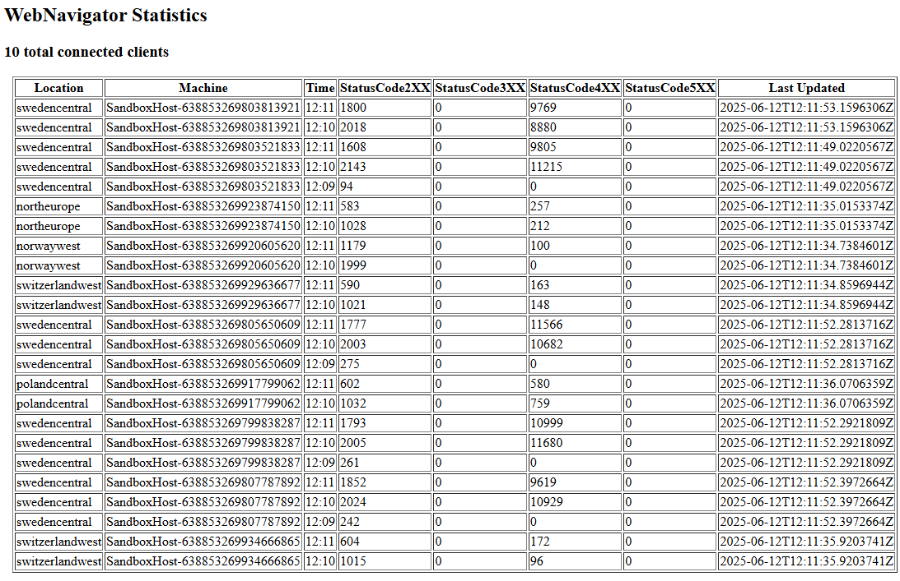

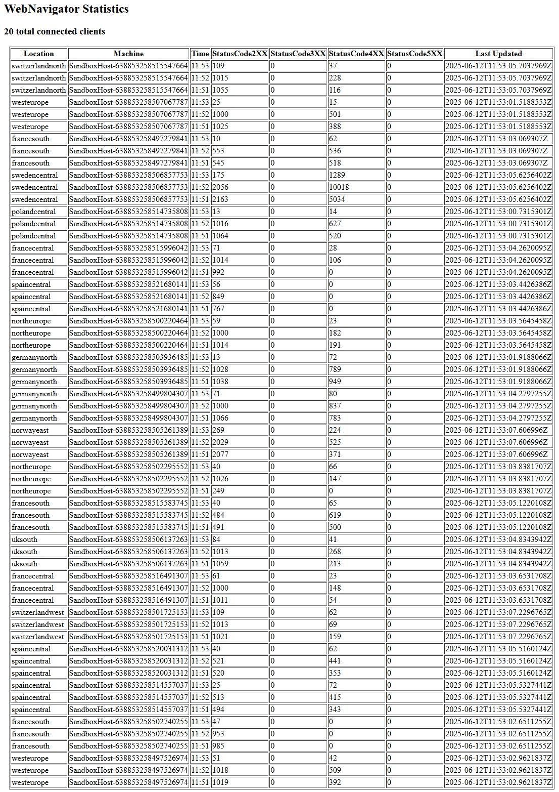

Remember to monitor the application gateway scaling:

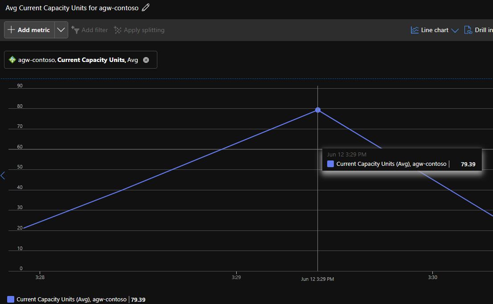

### Example 2

More complex deployment to test rate limiting and geo rate limiting at once:

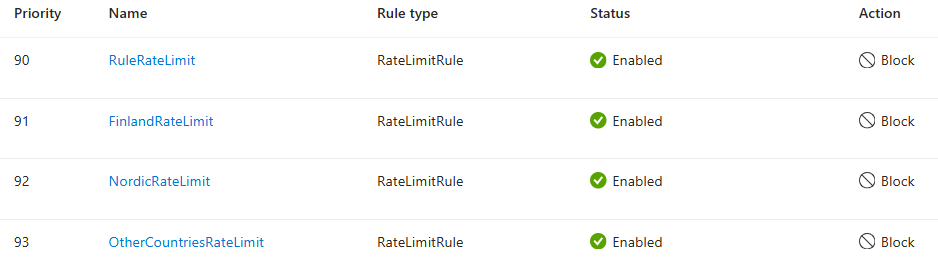

Limit usage per client address to 6000 requests per minute:

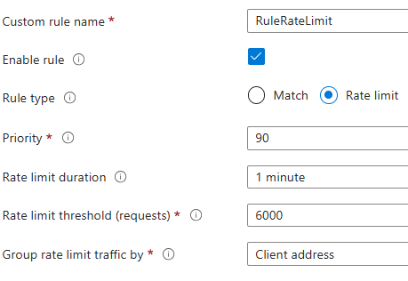

Limit usage from Finland to 4000 requests per minute per client address:

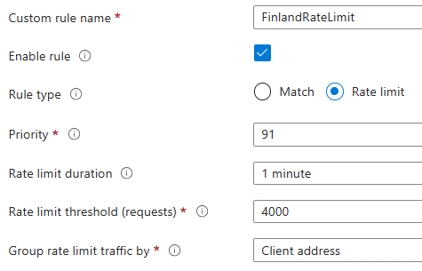

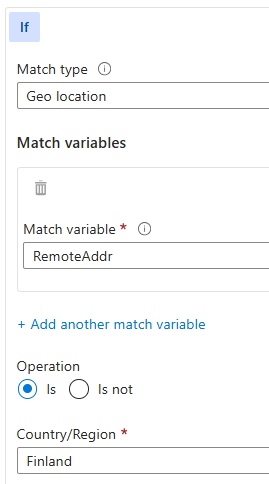

Similarly, limit usage per Nordic countries to 2000 and other countries to 1000 requests per minute per client address.

`OtherCountriesRateLimit` is using "Is not" as the operation:

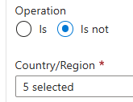

Execute two tests at the same time:

```powershell
.\perf-test.ps1 -navigateUri http://$appGwfqdn -TestDuration 60 -InstanceCount 5 -Location swedencentral -ReportUri https://<yourappservice>.azurewebsites.net/api/serverstatistics -ReportInterval 5

.\perf-test.ps1 -navigateUri http://$appGwfqdn -TestDuration 60 -InstanceCount 5 -GeographyGroup Europe -ReportUri https://<yourappservice>.azurewebsites.net/api/serverstatistics -ReportInterval 5
```

The above deploys 5 test intances to Sweden and 5 instances randomly across Europe regions.

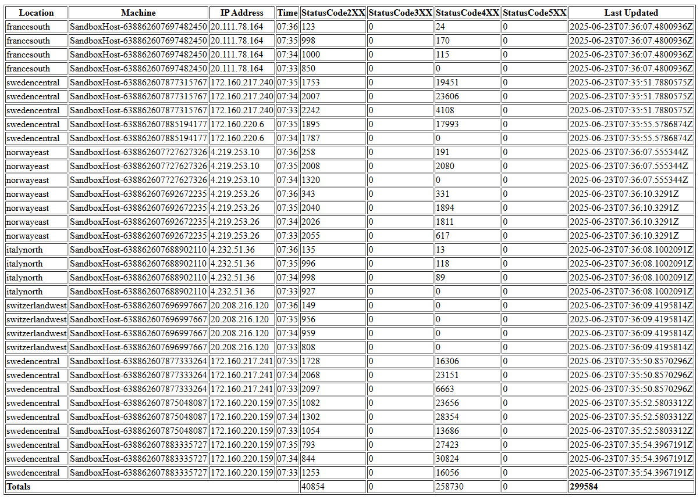

`Sweden Central` and `Norway East` deployed machines have higher usage and e.g.,`France South` is gapped to lower rate limit.

From
[What is rate limiting for Web Application Firewall on Application Gateway?](https://learn.microsoft.com/en-us/azure/web-application-firewall/ag/rate-limiting-overview)

> The rate limit thresholds **aren't always enforced exactly as defined**,
> so it shouldn't be used for fine-grain control of application traffic.
> Instead, it's recommended for **mitigating anomalous rates of traffic and for maintaining application availability**.
> <br/><br/>
> The **sliding window algorithm** blocks all matching traffic for the first window
> in which the threshold is exceeded, and then throttles traffic in future windows.
