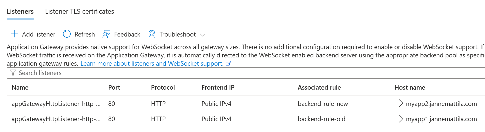
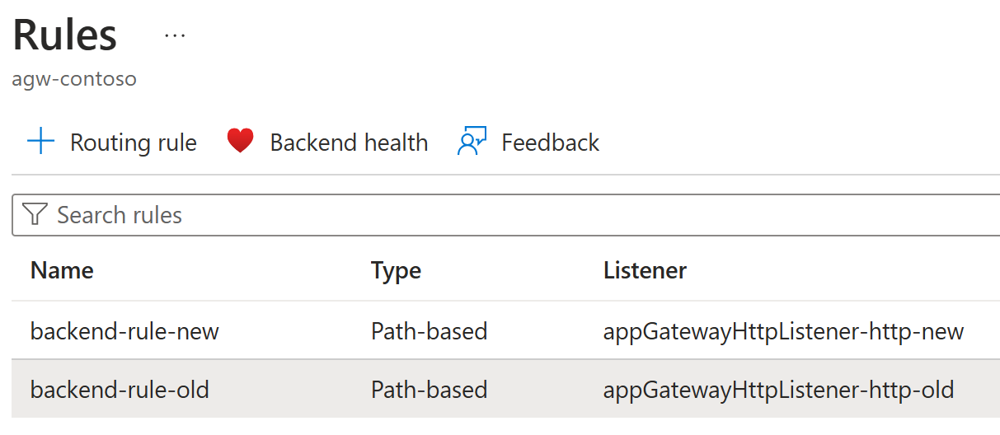
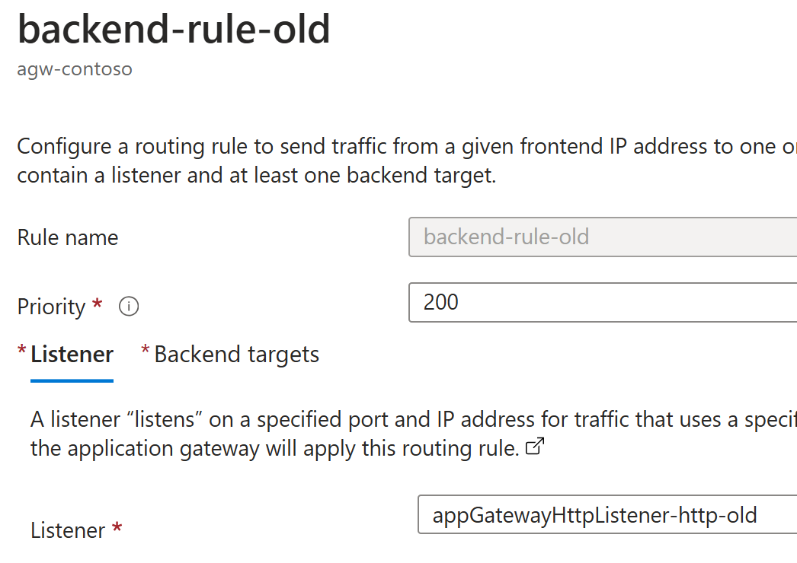
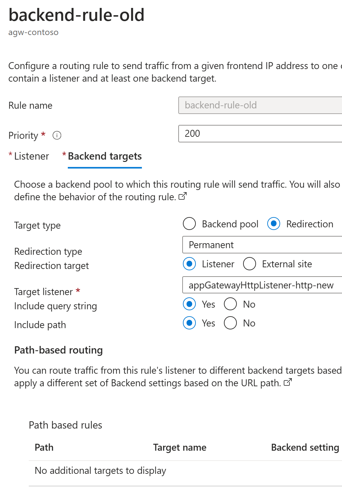
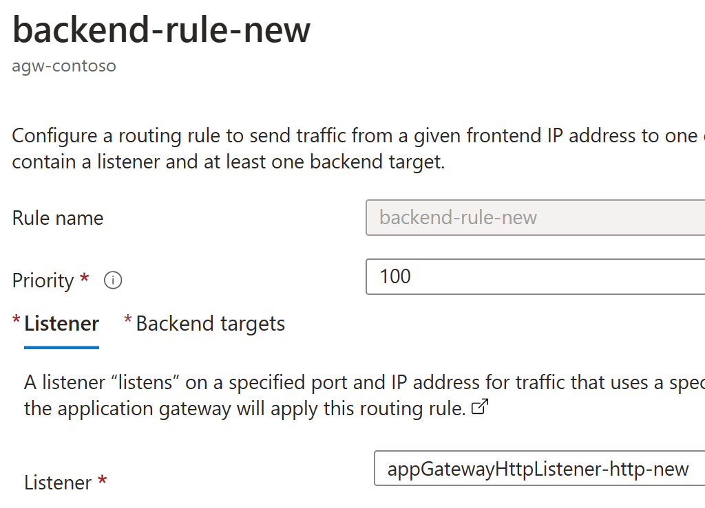
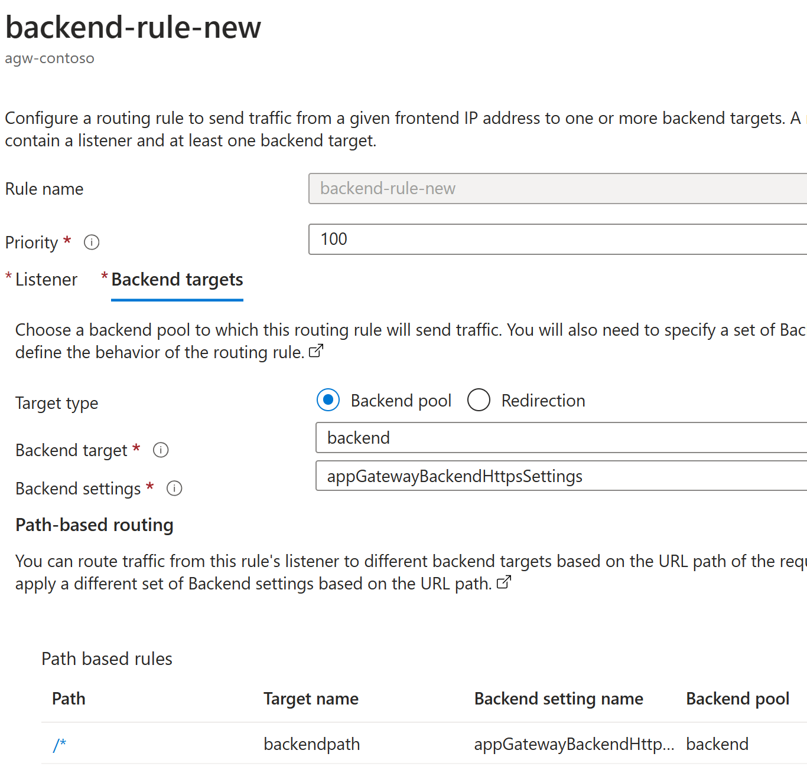

# Azure Application Gateway Redirect

### Deploy

```powershell
.\deploy.ps1
```

## Setup

Listeners:



Routing rules:



Routing rules - OLD:




Routing rules - NEw:




<!--
Line |
  45 |  $result = New-AzResourceGroupDeployment `
     |            ~~~~~~~~~~~~~~~~~~~~~~~~~~~~~~~
     | 12.58.21 - The deployment 'Local-2024-10-09-12-57-47' failed with error(s). Showing 1 out of 1 error(s). Status Message: Application Gateway SKU tier Standard has been deprecated. Supported   
     | SKU tiers are Standard_v2,WAF_v2. Refer https://aka.ms/V1retirement. (Code: AppGatewayV1SkuDeprecated)   CorrelationId: 5820f529-5163-4dd8-9007-94218b95f4ee
-->

### Configurations


### Test

```powershell
curl http://myapp1.jannemattila.com --verbose
curl http://myapp2.jannemattila.com
curl http://contoso00000000090.swedencentral.cloudapp.azure.com --verbose
```

```console
$ curl http://contoso00000000090.swedencentral.cloudapp.azure.com
<html>
<head><title>404 Not Found</title></head>
<body>
<center><h1>404 Not Found</h1></center>
<hr><center>Microsoft-Azure-Application-Gateway/v2</center>
</body>
</html>

$ curl http://myapp1.jannemattila.com --verbose
< ...abbreviated...
< Location: http://myapp2.jannemattila.com/
<
<html>
<head><title>301 Moved Permanently</title></head>
<body>
<center><h1>301 Moved Permanently</h1></center>
<hr><center>Microsoft-Azure-Application-Gateway/v2</center>
</body>
</html>
$ curl http://myapp2.jannemattila.com --verbose
<response from the backend>
```

### Clean up

```powershell
Remove-AzResourceGroup -Name "rg-appgw-redirect-demo" -Force
```
